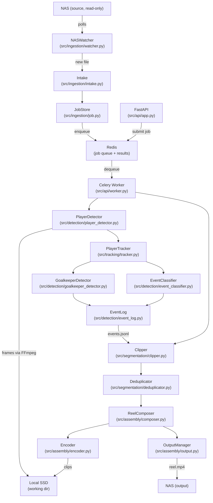
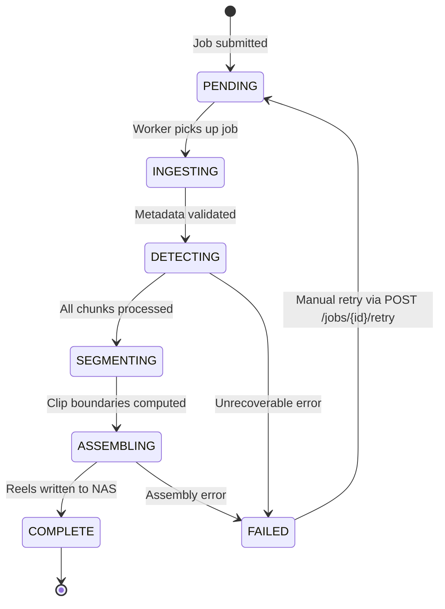

# Soccer Video Pipeline — Architecture

## Overview

The pipeline processes large 4K soccer match recordings from a NAS and produces
structured output reels via CV-based event detection and FFmpeg clip assembly.

---

## C4 Context Diagram

```mermaid
C4Context
    title Soccer Video Pipeline — System Context

    Person(user, "Coach / Analyst", "Drops match recordings on NAS, receives output reels")
    System(pipeline, "Soccer Video Pipeline", "Detects events, assembles reels")
    SystemExt(nas, "NAS Storage", "Source MP4s (read-only) + output reels")
    SystemExt(gpu, "GPU (optional)", "Accelerates YOLO inference")

    Rel(user, nas, "Copies match MP4")
    Rel(pipeline, nas, "Reads source, writes reels")
    Rel(pipeline, gpu, "Inference acceleration")
    Rel(user, pipeline, "Submits jobs via REST API / monitors via Flower")
```

---

## Component Diagram



---

## Data Flow

```
NAS Source (read-only)
  │
  ▼
[Intake] → VideoFile metadata + SHA-256
  │
  ▼
[Detection Pipeline] — chunked 30s windows
  │  ├── FFmpeg extracts frames → local SSD (cleaned per chunk)
  │  ├── YOLOv8m: player + ball bounding boxes per frame
  │  ├── ByteTrack: persistent track IDs across frames
  │  ├── GoalkeeperDetector: identify GK track
  │  └── EventClassifier: classify events → events.jsonl
  │
  ▼
[Segmentation]
  │  ├── compute_clips(): pad events → ClipBoundary list
  │  └── postprocess_clips(): deduplicate, enforce duration limits
  │
  ▼
[Assembly]
  │  ├── ReelComposer: extract clips via FFmpeg (stream-copy) → local SSD
  │  ├── concat_clips(): FFmpeg concat demuxer → reel.mp4 on SSD
  │  └── OutputManager: copy → NAS output (atomic rename)
  │
  ▼
NAS Output: {job_id}/goalkeeper_reel.mp4
             {job_id}/highlights_reel.mp4
             {job_id}/manifest.json
```

---

## Job Lifecycle State Machine



---

## Technology Stack Rationale

| Component | Choice | Rationale |
|-----------|--------|-----------|
| Video I/O | FFmpeg subprocess | NAS-tolerant buffered reads; no Python RAM limits |
| Detection | YOLOv8m (Ultralytics) | Best accuracy/speed for player detection at 1280px |
| Tracking | ByteTrack (boxmot) | Low-latency, no appearance features needed |
| Action Recognition | Heuristic + motion analysis | No labeled dataset available; rules-based on tracks |
| Job queue | Celery + Redis | Standard, battle-tested; Redis available as sidecar |
| API | FastAPI | Async, auto-docs, Pydantic integration |
| Persistence | File-based (JSONL + JSON) | No DB dependency; survives restarts; NAS-writable |

---

## Key Design Decisions

### ADR-001: No Full-File RAM Loading
Video frames are extracted to local SSD in 30s chunks via FFmpeg subprocess.
Python never holds more than one chunk's decoded frames simultaneously.

### ADR-002: Stream-Copy First
FFmpeg `-c copy` is attempted before any re-encode. This preserves 4K quality
and is ~100x faster. Re-encode fallback used only when keyframe boundaries
make stream-copy produce corrupt output.

### ADR-003: File-Backed Job Store
Jobs are JSON files in WORKING_DIR/jobs/. No database required.
Atomic writes (tmp→rename) prevent partial-write corruption.
Trade-off: no query capability — list_all() reads all files.

### ADR-004: Append-Only Event Log
events.jsonl is append-only. Duplicate event_ids are resolved on read (last write wins).
This enables idempotent retries: re-running detection just appends duplicates
which are silently deduplicated.

### ADR-005: Chunked Processing with Overlap
30s chunks with 2s overlap prevent events at chunk boundaries from being missed.
The EventLog deduplication handles any duplicate events from the overlap region.
