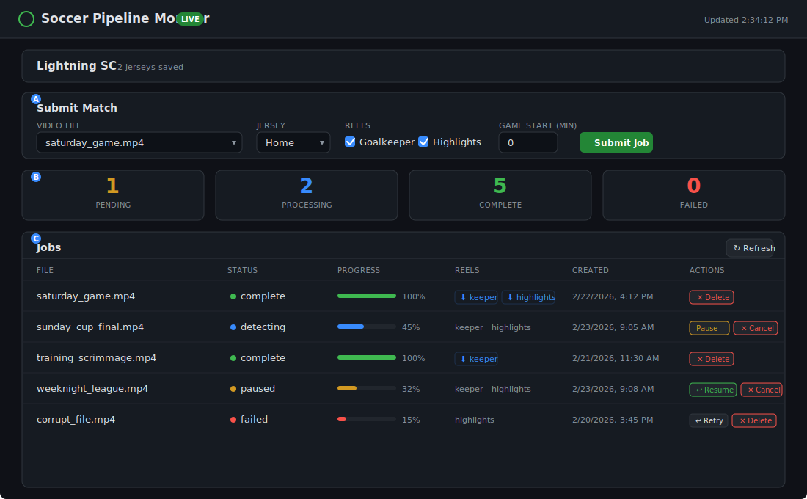

# Web UI Guide

The pipeline ships with a built-in monitoring dashboard at **`/ui`** — no build step, no external dependencies. It is a single self-contained HTML page served directly by the FastAPI app.

**URL:** `http://localhost:8080/ui`

---

## Screenshot



---

## Sections

### A — Submit Match

Submit a new processing job without leaving the browser.

| Control | Description |
|---------|-------------|
| **Video File** | Dropdown listing every video file (`.mp4`, `.mkv`, `.mov`, `.avi`, `.mts`, `.m2ts`, `.ts`) found in your NAS mount directory. Populated automatically from `GET /files`. |
| **Jersey** | Which kit your team wore in this game. Options come from your saved team config (see `./setup-team.sh`). |
| **Reels** | Checkboxes for **Goalkeeper** and **Highlights**. Both are checked by default. Uncheck one if you only need a single reel type. |
| **Game start (min)** | Number of minutes into the video where the actual game begins. Use this to skip pre-game warmup footage that can cause false detections. Default is 0 (start from the beginning). Converted to seconds internally. |
| **Submit Job** | Sends a `POST /jobs` request and starts processing. Idempotent — submitting the same file twice returns the existing job. |

### B — Stats Row

Four cards showing real-time counts across all jobs:

| Card | Color | Meaning |
|------|-------|---------|
| **Pending** | Yellow | Queued, waiting for a worker |
| **Processing** | Blue | Currently in one of: ingesting, detecting, segmenting, assembling |
| **Complete** | Green | Finished — reels ready for download |
| **Failed** | Red | Something went wrong (click Retry in the table) |

### C — Jobs Table

The main status table. Auto-refreshes every 10 seconds.

| Column | Description |
|--------|-------------|
| **File** | Source video filename |
| **Status** | Current pipeline stage with a color-coded dot (pulsing = actively processing) |
| **Progress** | Percentage bar from 0% to 100% |
| **Reels** | Which reel types were requested. When complete, these turn into download links. |
| **Created** | Timestamp of when the job was submitted |
| **Actions** | Context-sensitive buttons depending on job status (see below) |

#### Action Buttons

| Button | Shown when | Effect |
|--------|-----------|--------|
| **Pause** | Job is active (pending through assembling) | Requests pause at next chunk boundary. Job finishes with partial reels. |
| **Resume** | Job is paused | Re-queues the job from the beginning. |
| **Cancel** | Job is active or paused | Cancels processing. Partial reels are kept. |
| **Retry** | Job is failed or cancelled | Re-queues the job from scratch. |
| **Delete** | Job is complete, failed, paused, or cancelled | Removes the job record. |

---

## Job Status Lifecycle

The status dot color reflects where the job is in the pipeline:

```
pending (yellow)
  → ingesting (blue, pulsing)
  → detecting (blue, pulsing)
  → segmenting (blue, pulsing)
  → assembling (blue, pulsing)
  → complete (green)

At any active stage:
  → paused (yellow) — via Pause button, resumes with Resume
  → cancelled (gray) — via Cancel button, can Retry

At any stage → failed (red) — can Retry
```

---

## Toast Notifications

Actions like submitting a job, retrying, or deleting produce a toast message in the bottom-right corner:

- **Green toast** — success (e.g., "Job submitted: a1b2c3d4...")
- **Red toast** — error (e.g., "Submit failed: Video file not found")

Toasts auto-dismiss after 3.5 seconds.

---

## API Endpoints Used by the UI

| Endpoint | Method | Purpose |
|----------|--------|---------|
| `/team` | GET | Load team name and jersey options |
| `/files` | GET | List available video files from NAS |
| `/jobs?limit=50` | GET | Fetch job list (polled every 10s) |
| `/jobs` | POST | Submit a new job |
| `/jobs/{id}/pause` | POST | Request pause of an active job |
| `/jobs/{id}/resume` | POST | Resume a paused job |
| `/jobs/{id}/cancel` | POST | Cancel an active or paused job |
| `/jobs/{id}/retry` | POST | Re-queue a failed or cancelled job |
| `/jobs/{id}` | DELETE | Remove a completed, failed, paused, or cancelled job |
| `/reels/{id}/{type}/download` | GET | Download a finished reel |

---

## Technical Notes

- **No build step.** The entire UI is a single HTML string in `src/api/routes/ui.py`, served with `Cache-Control: no-store`.
- **No external CDN.** Everything is inline — CSS, JS, SVG icon. Works on air-gapped networks.
- **Auto-refresh.** The jobs table polls `GET /jobs` every 10 seconds. The team config and file list are loaded once on page load.
- **Team config optional.** If no team is configured, a yellow banner prompts the user to run `./setup-team.sh`.
